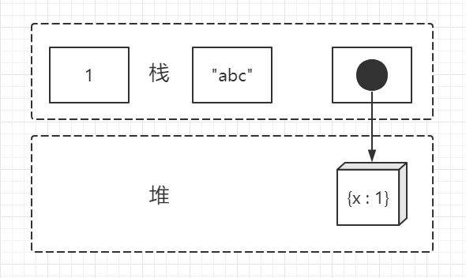

# JS 基本类型之装箱操作
众所周知，JS 是一门弱类型语言。它不需要事先具体声明变量的类型，因为会在程序运行过程中，类型会被自动推断确定。因此，可以用同一个变量保存不同类型的数据：

```javascript
var a = 1;
a = 'abc';
a = {
  x: 1
};
```
JS中目前共有7种数据类型：`Undefined`、`Null`、`Boolean`、`Number`、`String`、`Symbol` 和 `Object`。

前 6 者是基本类型数据，`Object` 是引用类型数据。

二者有什么区别呢？

变量保存基本类型数据时，是直接栈内保存的，而引用类型是在堆中生成，在栈内保存的是该对象的引用。
<p align="center">
	
</p>

除此之外，还有一点不同就是：基本类型数据本身不可变，但引用类型数据是可变的。

引用类型数据是可变的，不言而喻，是指我们可以修改其属性值。
```javascript
var a = {
  x: 1
};
a.x = 2
console.log(a); // => {x: 2}  
console.log(a.x); // 2  
```
a.x 或者 a['x'] 中“.”和“[]”操作符是专门用来获取引用类型属性值的。然而在 JS 中基本类型变量也是可以使用“点”的，这给初学者造成一定困惑，比如：
```javascript
var a = 1;
a.x = 2;
console.log(a);// 1  
console.log(a.x);// undefined  
```
其实，上述代码运行过程中发生了所谓的“装箱”操作。

比如第二行：
```javascript
a.x = 2
```
等价于：
```javascript
var temp = new Number(a)
temp.x = 2
temp = null
```
因为 2 是基本类型，在取其属性时，先用对应的 `Number` 构造函数包裹成一个临时对象，然后再对临时对象取属性值操作，随后这个临时对象便销毁。

整个过程称为“装箱”。知道这个过程后，那么整段代码就好理解了：
```javascript
var a = 1;
var temp1 = new Number(a);
temp1.x = 2;
temp1 = null;
console.log(a);// 1  
var temp2 = new Number(a);
console.log(temp2.x);// undefined  
temp2 = null;
```
看到了吗，两次 `a.x`，有两次“装箱”，因此是两个不同的临时对象。给一个对象存值，然后再去另外一个对象那里取值，必然是取不到的。

“装箱”这种说法是来自其他语言的。其实叫啥名字无关紧要，主要是理解这个过程，不再迷糊。

接下来的内容，我们准备去看看 JS 文档规范里是怎么描述的这个问题的。

为了方便，我们看第 3 版就行，即《ECMA-262 3rd edition》。该规范比较早，当然也可以看最新的。

其中第 44 页，第 11.2.1 小节，对属性访问器（Property Accessors）描述如下：

> The production MemberExpression : MemberExpression [ Expression ] is evaluated as follows:  
1.Evaluate MemberExpression.  
2.Call GetValue(Result(1)).  
3.Evaluate Expression.  
4.Call GetValue(Result(3)).  
5.Call ToObject(Result(2)).  
6.Call ToString(Result(4)).  
7.Return a value of type Reference whose base object is Result(5) and whose property name is Result(6).  

它是以“[]”属性访问方式为例来说明的。

这里再具体举一个例子，来看看整个流程。比如，a = 1，然后获取 a['x'] 。

> 1.计算表达式 a。（这里用表达式是考虑到像这种情形：a.b['x']，此时表达式是 a.b）    
2.获取上一步结果的值，这里是1。   
3.计算表达式 'x'。（这里用表达式是考虑到像这种情形：a['x'+'y']，此时表达式 'x'+'y'）   
4.获取第 3 步的结果，即 'x'。   
5.把第 2 步的结果传入 ToObject，即 ToObject(1)。这里记做 temp（可以看出这一步是关键。）   
6.把第 4 步，转化为字符串，当然还是 'x'   
7.返回，temp['x']。

其中第 5 步，最为关键。它用 ToObject 生成个临时对象（因为它只是局部变量），我们最后取到的属性值正是这个对象的属性值。

`ToObject`(第 48 页)操作具体为：

|Input|	Type Result|
|-----|-----|
|Undefined|	Throw a TypeError exception.|
|Null|	Throw a TypeError exception.|
|Boolean|	Create a new Boolean object whose [[value]] property is set to the value of the boolean. See 15.6 for a description of Boolean objects.|
|Number	|Create a new Number object whose [[value]] property is set to the value of the number. See 15.7 for a description of Number objects.|
|String	|Create a new String object whose [[value]] property is set to the value of thestring. See 15.5 for a description of String objects.|
|Object	|The result is the input argument (no conversion).|
与我们预知的一样，布尔、数值和字符串这三种类型都生成相应的对象示例。而对象类型，直接返回本身。另外，`Undefined `和 `Null` 类型是报错的。

至此，JS 的“装箱”操作说完了。

感谢你的阅读。

本文完。

[《JavaScript 迷你书》传送门，全面夯实基础](https://github.com/qdlaoyao/js-book)